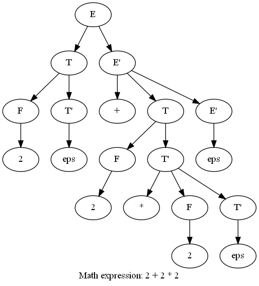
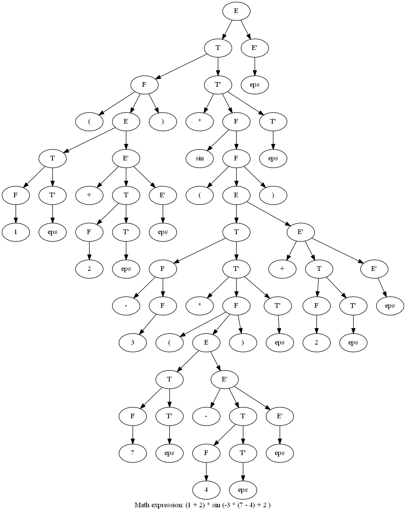

# Лабораторная работа №2.Ручное построение нисходящих синтаксических анализаторов.

Лабораторную выполнил студент группы М33371, Курдюков Кирилл. 

### Вариант 1. Арифметические выражения. 

Арифметические выражения с операциями сложения, вычитания,
умножения, скобками, унарным минусом и унарными функциями. Приоритет операций стандартный. 
Скобки используются для изменения приоритета и передачи аргументов в функции.

В качестве операндов выступают целые числа. Используйте один терминал для всех чисел. 
Любая последовательность букв задает имя функции. Используйте один терминал для всех функций.

Пример: (1+2)*sin(-3*(7-4)+2)

### Ход работы. 

### 1. Разработка грамматики 

Интуитивная грамматика для арифметических выражений выглядит следующим образом:

    E -> E + E | E - E | E * E | E / E | (E) | sin E | cos E | n! | -n // n >= 0

Однако такая грамматика содержит *левую рекурсию*, *правое ветвление* и является *неоднозначной*.
Попробуем придумать более удачную грамматику для рассматриваемоего языка. Например:

    E -> T + E | T - E | T
    T -> F * T | F / T | F
    F -> sin F | cos F | n | (E) | -n

Видно, что данная грамматика содержит только *правое ветвление*. Исправим: 

    E -> TE'
    E'-> +E | -E | eps
    T -> FT'
    T'-> *T | +T | eps 
    F -> sin F | cos F | n | (E) | -n

Для простоты анализирования раскроем нетерминалы E и T в правилах для E' и T'.

    E -> TE'
    E'-> +TE' | -TE' | eps
    T -> FT'
    T'-> *FT' | /FT' | eps
    F -> sin F | cos F | n | (E) | -n

Описание:

| Нетерминал | Описание |
| :-------: | :------: |
| E | Expression |
| E' | continue Expression | 
| T | Term | 
| T' | continue Term | 
| F | Factor | 

Отлично, эта грамматика соответствует LL(1) грамматике (убедимся в следующем пункте). А значит по ней 
можно построить нисходящий парсер или иначе рекурсивный спуск, так называемый. 

### 2. Построение лексического анализатора.

Лексический анализатор должен получать на вход строку и выдавать
последовательность терминалов (токенов). Пробелы и переводы строк
должны игнорироваться. 

Лексический анализатор, написанный мной, на ходится в пакете *lexica*.

Его идея очень проста. Бьем регуляркой выражение на образцы. А затем пытаемся 
матчится по образцу и понять какой это токен. Иначе выбросим ошибку о том, что 
перед нами не ожиданный токен.

<code> Pattern.compile("sin|cos|\\d+|.") </code> 

Пользуюсь ценично тем, что он жадный. Смотрит слева на право. 

### 3. Построение синтаксического анализатора. 

Построим множества FIRST и FOLLOW для нетерминалов нашей
грамматики. Затем напишим синтаксический анализатор с использованием рекурсивного спуска.

| Нетерминал | FIRST | FOLLOW |
| :---: | :---: | :---: |
| E | sin, cos, (, n, ! | $, ) | 
| E' | +, -, eps | $, ) |
| T | sin, cos, (, n, ! | +, -, $, )|
| T' | *, /, eps | +, -, $, ) |
| F | sin, cos, (, n, ! | +, -, *, /, $, ) |

Парсер математических выражений находится в пакете *parser*. Самый наивный рекурсивный спуск,
c анализом текущего токена и выбор правила по нему. Инвариант, что при в ходе в новый нетерминал.
Мы находимся на начале текущего токена. И при раскрытия нетерминала, мы переходим к следующему.

### 4. Визуализация дерева разбора. 

Запустим проект на двух тестовых примерах: 

### 5. Подготовка набора тестов.

Тесты приведены в папке test / java 

LexicaAnalyzerTest тестирует разбиение на токены.
MathExpressionParserTest тестурует разбор токенов. 
