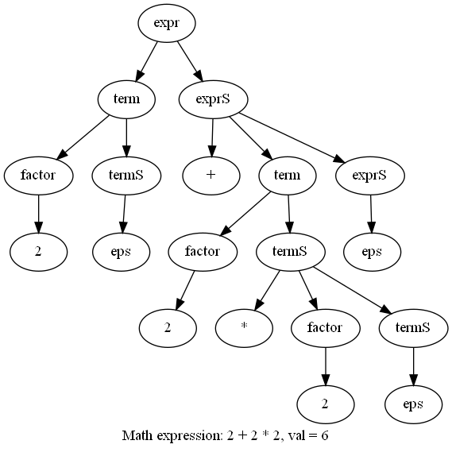
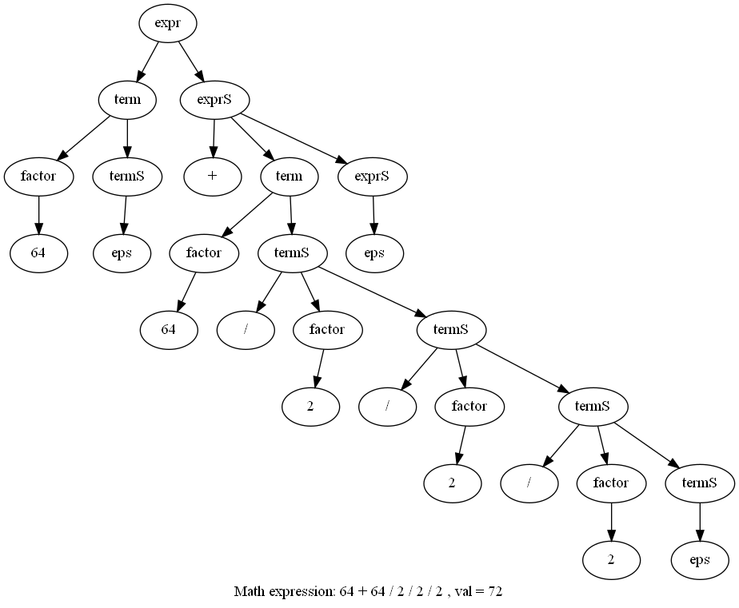

#Лабораторная работа №4. Написание упрощенного аналога генератора трансляторов. 

За основу брался синтаксис ANTLR. Разборщик грамматик был сгенерирован с помощью ANTLR. 

###Класс грамматик.

* LL(1) - грамматики, нисходящий разбор 

###Работа с атрибутами.

* поддержка ситезируемых атрибутов 
* поддержка наследуемых атрибутов

###Тестирование получившиегося генератора. 

* сгенерировать с помощью вашего генератора калькулятор 
* выполнить с помощью моего генератора задание второй лабораторной

### Ход работы. 

Генерация кода происходит в пакете generators, построение FOLLOW и FIRST,
генерация лексера, парсера и вспомогательных классов. 

В пакете meta_grammar находится грамматика грамматик и парсер сгенерированный антлр. 

Пример грамматики для моего гененератора:
    
    grammar math;
    
    expr () [int val] -> term() exprS(term0.val) {$val = exprS1.val;};
    
    exprS(int acc) [int val] ->
    PLUS term() {$val = acc + term1.val;} exprS($val) {$val = exprS2.val;}
    | MINUS term() {$val = acc - term1.val;} exprS($val) {$val = exprS2.val;} | ε {$val = acc;} ;
    
    term () [int val] -> factor() termS(factor0.val) {$val = termS1.val;};
    
    termS (int acc) [int val] ->
    MUL factor() {$val = acc * factor1.val;} termS($val) {$val = termS2.val;}
    | DIV factor() {$val = acc / factor1.val;} termS($val) {$val = termS2.val;} | ε {$val = acc;} ;
    
    factor () [int val] ->
    SIN factor() {$val = (int) Math.sin(factor1.val);}
    | COS factor() {$val = (int) Math.cos(factor1.val);}
    | NUM {$val = Integer.parseInt(NUM0);}
    | OPEN expr() CLOSE {$val = expr1.val;}
    | MINUS factor() {$val = (-1) * factor1.val;};
    
    PLUS: "\\+";
    MINUS: "-";
    MUL: "\\*";
    DIV: "/";
    SIN: "sin";
    COS: "cos";
    NUM: "[0-9]+";
    OPEN: "\\(";
    CLOSE: "\\)";

Терминалы строго большими буквами отдельно иницилизируем регулярным выражением. 
Нетерминалы соответствуют регулярке [a-z]+[A-Z]*. В круглых скобках синтезируемые атрибуты, а
в квадратных наследуюмые. Обращение к атрибуту в нетерминале происходит через $val, например. 
Тесты лежат в java / generators. Собственно тестами обложены сгенерированный код парсера математических выражений, 
лексер, построение FIRST и FOLLOW. 

Генерация кода происходит в gen / lexica_%s и в gen / parser_ %s (%s - это название грамматики).
Main, который это запускает находится в src / main / java.

Результат работы парсер арифметических выражений (по совместительству 2 лаба):

Построение графа произходит в пакете src / main / java / graph.